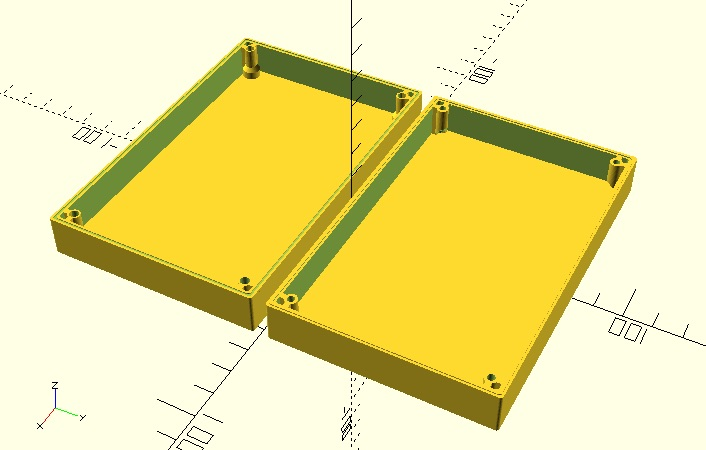

use <MCAD/boxes.scad>

### OpenSCAD Electronics box where the screws are put at the bottom
Should beable to get it 3D printed without isues.
//
### License: License MIT

## Usage 1:

```
// Make abox with the following specifications:
// Length: 125
// Width:  80
// Depth: 30
// Wall Thickness:  2.4
// Screw Diameter:  3
// Screw Head Size: 6
$fn=50;
box(125, 80, 30, 2.4, 3, 6);
```


## Usage 2:
```
// Create a box where top and bottom are of different dimentions
// Length: 125
// Width:  80
// Depth: 17 ( of each single side)
// Wall Thickness:  2.4
// Screw Diameter:  4
// Screw Head Size: 8
// Fixture location of wall size: 6
// rim depth: 0.75
$fn=50;
box_top   (125, 80, 17, 2.4, 4, 8, 6, 0.75);
box_bottom(125, 80, 14, 2.4, 4, 8, 6, 0.75);
```

